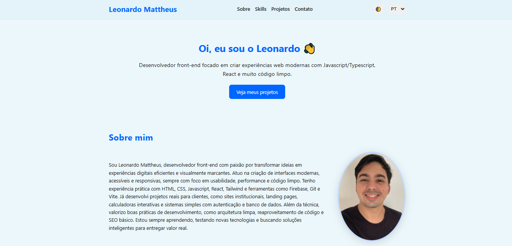

#   
<!-- Substitua CAMINHO_DA_IMAGEM_AQUI pelo link ou caminho relativo da sua imagem -->

<div align="center">


[](mailto:seuemail@email.com)

</div>

# 💼 Portfólio | Leonardo Mattheus

Bem-vindo ao meu portfólio profissional de desenvolvedor!  
Este projeto foi criado para apresentar minhas habilidades, experiências, projetos pessoais e oferecer uma forma de contato direto comigo.

---

## 📌 Sobre Mim

Sou desenvolvedor apaixonado por tecnologia, design de interfaces e soluções criativas.  
Com experiência em desenvolvimento web, busco criar aplicações funcionais e visualmente agradáveis, sempre priorizando a experiência do usuário (UX/UI).

---

## 🚀 Tecnologias Utilizadas

- **HTML5**
- **CSS3 / SASS**
- **JavaScript**
- **React.js** *(em breve)*
- **Git & GitHub**
- **Responsividade & Design Moderno**

---

## 🖥️ Estrutura do Projeto

O projeto está dividido em seções essenciais para destacar minha trajetória:

- **Home** – Apresentação com animações leves
- **Sobre Mim** – Minha trajetória profissional e acadêmica
- **Projetos** – Galeria com links e descrições dos meus principais projetos
- **Contato** – Formulário funcional e links para redes sociais

---

## 📸 Exemplos Visuais

🔗 [Acessar portfólio ao vivo](https://leomatth.vercel.app) *(se houver deploy)*

---

## 🛠️ Como Rodar Localmente

```bash
# Clone este repositório
git clone https://github.com/leomatth/portfolio-leomatth

# Acesse a pasta
cd portfolio-leomatth

# Abra o arquivo index.html em seu navegador

```
## 📬 Contato
📧 Email: leomattheus95@gmail.com

💼 LinkedIn: [linkedin.com/in/seulink](https://www.linkedin.com/in/leonardo-mattheus-475578226/)

💻 GitHub: @leomatth

## 📝 Licença
Este projeto está sob a licença MIT.
Sinta-se à vontade para usar como base para o seu próprio portfólio.
Se fizer isso, dê os devidos créditos. 🙏

